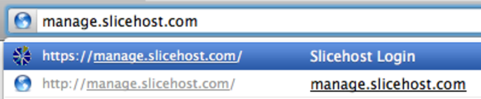
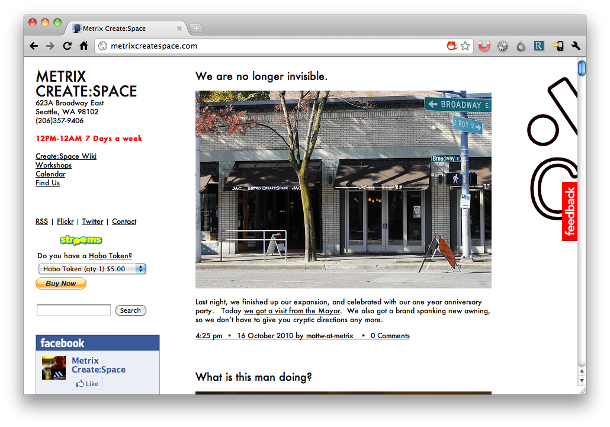
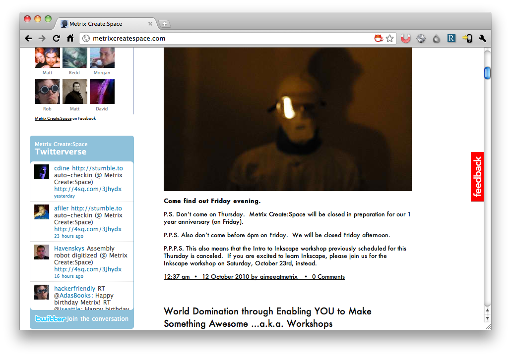
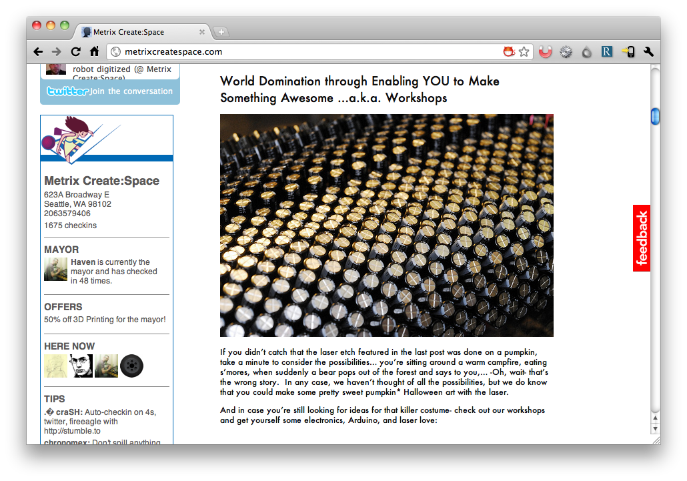
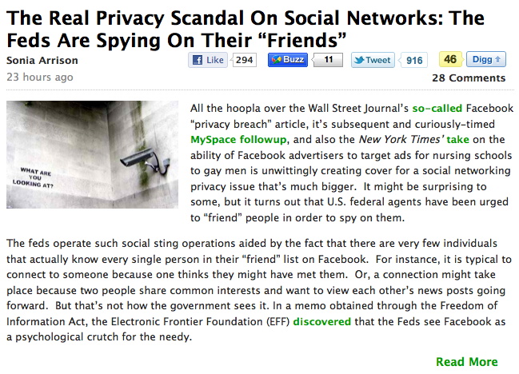

!SLIDE bullets incremental
# How to stay safe?
* Lots of things work against you.

!SLIDE bullets incremental
# Avoiding insecure sites when on wifi?
* Good luck.

!SLIDE center

!SLIDE center

!SLIDE center

!SLIDE center

!SLIDE center

!SLIDE bullets incremental
# Avoiding insecure sites when on wifi?
* Doesn't matter in the end.
* Active attacker can redirect your browser.  (SSLStrip)

!SLIDE bullets incremental
# Log out
* But don't forget.
* Logging out doesn't guarantee session is invalidated.

!SLIDE bullets incremental
# Use only secure wifi
* WPA2 designed to protect clients from each other.
* No more coffee shops for you.
* Wifi has long history of problems. (Hole 196)
* Do you trust the network operator?
* What about ISP?

!SLIDE bullets incremental
# VPN
* Good, but:
* Doesn't come up right away.
* What happens when it drops?
* Pushes problem to the other side.
* Slow, annoying.

!SLIDE bullets incremental
# Need *end-to-end* encryption
* Traffic should be private between you and destination.
* Other solutions just move problem, don't fix.

!SLIDE center
